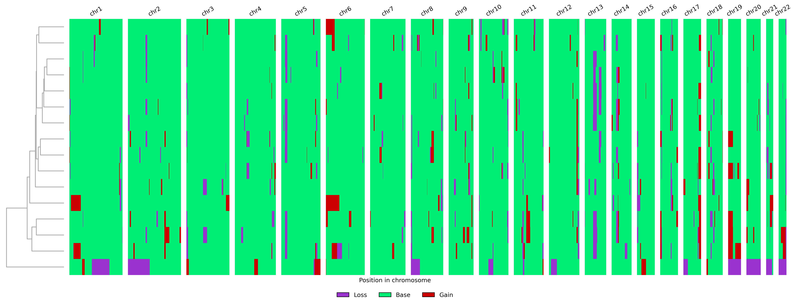

# pyEpiAneufinder: Identifying copy number alterations from single-cell ATAC-seq data

This package is the python version of our R package epiAneufinder. 

**Important remark:** The python package is still in beta-testing. We welcome your feedback! Please report any issues and improvement suggestions via Github Issues.

epiAneufinder is an algorithm used for calling Copy Number Variations (CNVs) from single-cell ATAC (scATAC) data. Single-cell open chromatin profiling via the single-cell Assay for Transposase-Accessible Chromatin using sequencing (scATAC-seq) assay has become a mainstream measurement of open chromatin in single-cells. epiAneufinder exploits the read count information from scATAC-seq data to extract genome-wide copy number variations (CNVs) for each individual cell. epiAneufinder allows the addition of single-cell CNV information to scATAC-seq data, without the need of additional experiments, unlocking a layer of genomic variation which is otherwise unexplored.

Ramakrishnan, A., Symeonidi, A., Hanel, P. et al. epiAneufinder identifies copy number alterations from single-cell ATAC-seq data. Nat Commun 14, 5846 (2023). https://doi.org/10.1038/s41467-023-41076-1

The R version (including more information) can be found here: https://github.com/colomemaria/epiAneufinder

### Installation

Potentially setup a new conda environment first (recommended). Then:

```
pip install git+https://github.com/colomemaria/pyEpiAneufinder
```

### Executing the program

The whole program can be run by calling the main function, using a fragment file as input, defined in the parameter `fragment_file`. The fragment file needs to be sorted first by cell and then by position (chromosome, start). This sorting can either be done manually before running pyEpiAneufinder or automatically within the main function when setting the parameter `sort_fragment = True`.

The `genome` needs to be  given as a fasta file. For example, the human genome hg38 can be downloaded from here:
https://hgdownload.soe.ucsc.edu/goldenPath/hg38/bigZips/hg38.fa.gz

Additionally, a `blacklist` file for regions of low mappability is required, the `windowSize` of the algorithms and optional a list of chromosomes to `exclude`. Cells with too little fragments are removed based on the parameter `minFrags`. All output files are saved in the directory `outdir`. 

```
import pyEpiAneufinder as pea
pea.epiAneufinder(fragment_file="sample_data/sample.tsv.gz", 
                  outdir="results_sample_data", 
                  genome_file="hg38.fa.gz", 
                  blacklist="sample_data/hg38-blacklist.v2.bed",
                  windowSize=100000, 
                  exclude = ["chrX","chrY"],
                  minFrags = 20000,
                  sort_fragment = True)
```

Test data for running epiAneufinder can be found on github in the directory [sample_data](sample_data).

The main output is saved in the file `result_table.csv`, which contains the CNV status per cell and bin encoded with 0=loss, 1=base and 2=gains. More information included intermediate results are saved in `count_matrix.h5ad`. The karyogram is additionally visualized in `Karyogram.png`. For the provided test data it looks like this:



### Splitting cells into clones

An easy approximation for identification of subclones in the dataset is splitting the hierarchical clustering using the function `split_subclones()`
into a user-defined number of cluster `num_clust`.  

```
import pyEpiAneufinder as pea
import pandas as pd

res = pd.read_csv("results_sample_data/result_table.csv",index_col=0)
clones = pea.split_subclones(res,num_clust=4)

```
These subclones can be visualized as an annotation bar in the karygram using the function `plot_karyo_annotated()`. In general, this function can be applied on all kind of categorical annotations, such as cell types. It requires the annotation parameter as a pandas DataFrame with barcodes as indices (matching the column names of the results) and a column called `annot` with categorical values.

```
#Reformat to fullfill input requirements for plotting
annot_dt = clones.copy()
annot_dt.index = annot_dt.barcode
annot_dt["annot"] = pd.Categorical("clone" + annot_dt.subclone.astype(str))

pea.plot_karyo_annotated(res,"karyo_annot.png",
                         annot_dt=annot_dt, title_karyo= "Karyogramm with annotation")
```


### Calculating karoygram metrics

The resulting CNVs (i.e. the karyogram) can be characterised based on the aneuploidy and heterogeneity score. Given a CNV result matrix with 𝑁 cells and 𝑇 bins and each entry being the CNV status 𝑐𝑖,𝑗 for cell 𝑖 and bin 𝑗, the metrics are defined as:

* **Aneuploidy**: the mean deviation from the baseline value b (default $b=1$), i.e. how many bins are gained or lost per cell

$$A = \frac{1}{T * N} \sum_{n=1}^{N} \sum_{t=1}^{T} |c_{n,t} - b|$$

* **Heterogeneity**: the mean heterogeneity for a bin across cells, i.e. how different is the CNV status across cells for the same bin. For this, across each bin, the frequenies for each CNV status f is estimated as $m_f$ and then ordered decreasing so that $m_{0,t} >= m_{1,t}  >= m_{2,t}$

$$H = \frac{1}{T * N} \sum_{t=1}^{T} \sum_{f=0}^{S} f * m_{f,t}$$

Both metrics are implemented genome-wide and per chromosome:

```
import pyEpiAneufinder as pea
import pandas as pd

res = pd.read_csv("results_sample_data/result_table.csv",index_col=0)

#Get the scores across the complete dataset
pea.compute_aneuploidy_across_sample(res)
#Result for test data: 0.07119973598700244
pea.compute_heterogeneity_across_sample(res)
#Result for test data: 0.07377132412672624

#Get the scores per chromosome
aneu_chrom = pea.compute_aneuploidy_by_chr(res)
heterogen_chrom = pea.compute_heterogeneity_by_chr(res)

#Create a scatterplot for this data
plot_data = pd.DataFrame({"chrom": aneu_chrom.columns.values,
                         "aneu": aneu_chrom.iloc[0],
                         "heterogen": heterogen_chrom.iloc[0]})
                         
sns.scatterplot(x="aneu",y="heterogen",data=plot_data)

#Add the chromosome name to each dot
for i in range(len(plot_data)):
    plt.annotate(plot_data["chrom"][i], (plot_data["aneu"][i], plot_data["heterogen"][i]))
    
plt.xlabel("Aneuploidy per chromosome")
plt.ylabel("Heterogeneity per chromsome")
plt.show()                         
```

For the example data, the scatter plot looks like this:


### Calculating CNV burden per cell

Based on the same formular, the aneuploidy per cell, also called CNV burden, can be estimated. This is another criterion to identify tumor cells besides marker gene expression.

```
import pyEpiAneufinder as pea
import pandas as pd

res = pd.read_csv("results_sample_data/result_table.csv",index_col=0)
cnv_burden = pea.compute_cnv_burden_cell(res)

```

### Coverage profiles per cell

The CNV predictions of pyEpiAneufinder on individual cells can be further explored by visualizing the count profiles of a specific cell using the function `plot_single_cell_profile()`.

```
import pyEpiAneufinder as pea
import pandas as pd

pea.plot_single_cell_profile(outdir="results_sample_data",
                             cell_name="AGTCCGGTCCACACCT-1",
                             plot_path="results_sample_data/somy_profile_cell.png")

```


### Authors of the python re-implementation

Katharina Schmid (katharina.schmid@bmc.med.lmu.de)

Aikaterini Symeonidi (asymeonidi@bmc.med.lmu.de and ksymeonidh@gmail.com)

Angelos Nikolaou (anguelos.nicolaou@gmail.com)

Ida Büschel (Ida.Bueschel@helmholtz-munich.de)

Maria Colomé-Tatché (maria.colome@helmholtz-muenchen.de)

### Version history

* 0.1
    * Initial Release (based on epiAneufinder v1.1.3)
